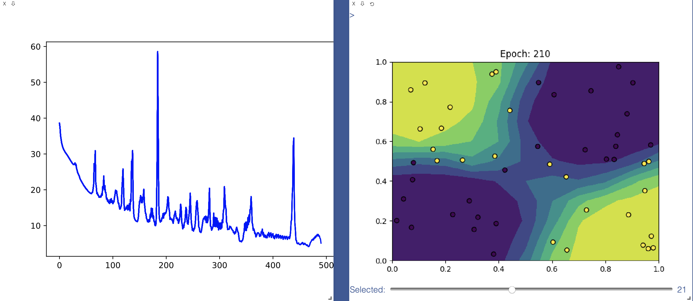

# MiniTorch Module 1


- Docs: https://minitorch.github.io/

- Overview: https://minitorch.github.io/module1.html

This module requires `operators.py` and `module.py` from Module 0

```
cp ../Module-0/operators.py ../Module-0/module.py minitorch/
```

- Tests:

```
python run_tests.py
```

## Output Log

### XOR Dataset

Setting up a new session...
Epoch 0 loss 38.5802414210677 correct 18 <br>

<!---
Epoch  10  loss  30.66670362586478 correct 37
Epoch  20  loss  28.366445647209495 correct 41
Epoch  30  loss  26.902611450724542 correct 37
Epoch  40  loss  22.655527672332013 correct 43
Epoch  50  loss  20.286541813213866 correct 42
Epoch  60  loss  18.93688586038522 correct 41
Epoch  70  loss  18.9627546820192 correct 41
Epoch  80  loss  18.514206528876205 correct 43
Epoch  90  loss  16.84758177647501 correct 44
--->

Epoch 100 loss 16.13076077422631 correct 41 <br>

<!---
Epoch  110  loss  16.291088359038238 correct 40
Epoch  120  loss  20.76562957035742 correct 39
Epoch  130  loss  14.587250515117535 correct 44
Epoch  140  loss  12.25464252906602 correct 47
Epoch  150  loss  16.7430790833905 correct 40
Epoch  160  loss  15.159065051148266 correct 42
Epoch  170  loss  13.143919198034812 correct 43
Epoch  180  loss  10.008754485720125 correct 43
Epoch  190  loss  11.388916820412794 correct 44
--->

Epoch 200 loss 13.88397976419723 correct 46 <br>
Epoch 210 loss 11.616236294729802 correct 44 <br>

<!---
Epoch  220  loss  12.226432258790402 correct 44
Epoch  230  loss  10.313345294961328 correct 46
Epoch  240  loss  10.563241039082348 correct 44
Epoch  250  loss  9.213745617814459 correct 45
Epoch  260  loss  12.643675351704227 correct 45
Epoch  270  loss  11.999915015178711 correct 44
Epoch  280  loss  15.671181708739317 correct 42
Epoch  290  loss  9.835206958057702 correct 45
--->

Epoch 300 loss 9.11783156061345 correct 45 <br>

<!---
Epoch  310  loss  17.7666665055641 correct 42
Epoch  320  loss  9.695507300065696 correct 44
Epoch  330  loss  7.949634685245456 correct 46
Epoch  340  loss  5.701781299959883 correct 48
Epoch  350  loss  8.643641276033035 correct 45
Epoch  360  loss  15.458028082639627 correct 44
Epoch  370  loss  7.506717505031187 correct 45
Epoch  380  loss  8.997295697951799 correct 46
Epoch  390  loss  7.578097977690405 correct 45
--->

Epoch 400 loss 7.734107837383815 correct 46 <br>

<!---
Epoch  410  loss  7.500252101357391 correct 46
Epoch  420  loss  6.805922224884888 correct 45
Epoch  430  loss  6.902438188764025 correct 46
Epoch  440  loss  16.633119797998912 correct 42
Epoch  450  loss  4.7390912554047935 correct 50
Epoch  460  loss  5.018209513260492 correct 48
Epoch  470  loss  5.22611605964194 correct 48
Epoch  480  loss  6.673423757543094 correct 47
--->

Epoch 490 loss 5.103741396269605 correct 49 <br>



